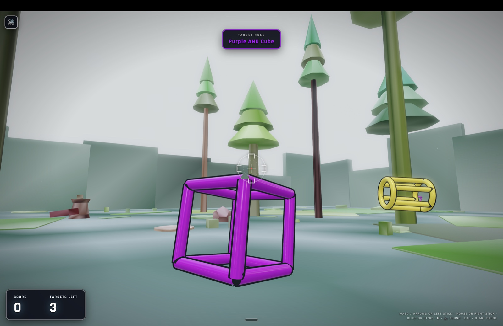
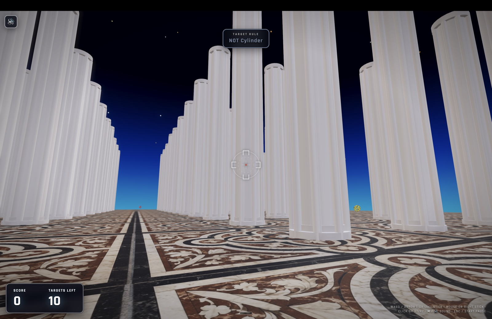

# Solids Hunter

First-person hunt built with [Babylon.js](https://www.babylonjs.com/). Pick an arena, read the round rule, then shoot only solids that satisfy the rule with desktop, gamepad, or mobile controls.

## Screenshots



*Forest — the rule is `Purple AND Cube`, so the purple cube counts and the yellow cylinder does not. Every solid is drawn as an open wireframe cage so its shape stays readable at range.*



*Duomo — a `NOT Cylinder` round opening down the nave. The HUD keeps the active rule overhead and the remaining target count bottom left.*

## Hunt rules

Each round draws a **random boolean rule** over the same seven colors and four shapes. Rules are always **satisfiable** — at least three matching solids are forced into the spawn set.

There are nine rule families, and the pool you draw from widens as you clear rounds:

| Family | Example | Matching pairs (of 28) |
| --- | --- | --- |
| `notColor` | `NOT Purple` | 24 |
| `notShape` | `NOT Sphere` | 21 |
| `orShape` | `Cylinder OR Sphere` | 14 |
| `orColor` | `Purple OR Red` | 8 |
| `compound` | `(Cyan AND Cylinder) OR White` | 5 |
| `andNot` | `Blue AND NOT Tetrahedron` | 3 |
| `and` | `White AND Sphere` | 1 |
| `andOr` | `Purple AND (Sphere OR Cylinder)` | 2 |
| `doubleAnd` | `(Red AND Sphere) OR (Yellow AND Cube)` | 2 |

The last two are the hardest: both ask you to hold two conditions at once.

The pre-round screen and in-game HUD show the rule in plain language.

## How solids move

Each solid picks one of four **movement modes**:

| Mode   | Behaviour |
|--------|-----------|
| **drift** | Slow walk toward random floor targets (classic wander). |
| **bounce** | Same horizontal motion with a stronger vertical bob and snappier spin. |
| **orbit** | Circles a fixed point on the ground with a gentle bob. |
| **slide** | Constant velocity on the XZ plane; reflects off arena bounds like a puck. |

## Adaptive rounds

Two separate things adjust between rounds.

**Rule complexity climbs with every round you clear**, one rung of a five-rung ladder, holding at the top. A session opens on a deliberately gentle pool (`and`, `notColor`, `notShape`) and works up to one where the two-condition families live. Each rung also retires the rules that have stopped asking anything — `NOT Purple` matches 24 of the 28 spawnable pairs, so leaving it in the top pool would keep dealing rounds that are over before they start. This tracks clears only: a game over does not count, but neither does being slow or sloppy, so the boolean gets harder as long as you keep finishing rounds.

**A separate director nudges one other axis at a time** — decoy composition, target count, movement mix, or speed. After two fast, accurate clears it asks for a little more; low accuracy or a game over makes the next round more forgiving. This adjustment is local, invisible, and only applies between rounds. It never changes the color palette, moves targets outside collision-safe bounds, or makes matching targets evade the player.

## Look and render quality

Environments use a **sky dome** with a vertical gradient, directional sun, and balanced lighting. **Forest** uses darker floors than perimeter walls; **dungeon**, **lab**, **duomo**, and stone use **`envTintHex`** for stable per-surface variation. The renderer uses antialiasing, fog where appropriate, and **ACES-style tone mapping** for readability.

### Duomo study and floor

The Duomo arena's pillar rhythm was studied from the included [historical plan image](assets/duomo/maps/Pianta_del_Duomo_di_Milano.jpg), sourced from Wikimedia Commons' [*Pianta del Duomo di Milano*](https://commons.wikimedia.org/wiki/File:Pianta_del_Duomo_di_Milano.jpg) (CC BY-SA 4.0; Unknown author / Istituto Campana per l'Istruzione Permanente, via Wikimedia Commons). It remains a stylized gameplay interpretation rather than an architectural reconstruction.

Its floor uses `mosaico_marmoreo_rinascimentale_ornamentale.jpg`, an AI-generated decorative mosaic created as a close-enough atmospheric fit. It is not a historical reproduction of the Duomo floor. The full-resolution master lives in [`assets/duomo/maps/`](assets/duomo/maps/) alongside the other source material; only the compressed runtime copy is shipped in a build.

## Run locally (Podman only — no host Node/npm)

The game needs HTTP (`fetch` for sounds).

```bash
cd solidshunter
make dev
# or: ./scripts/podman dev
```

Open **[http://127.0.0.1:5173/](http://127.0.0.1:5173/)** (add `?env=lab`, `dungeon`, `forest`, or `duomo` if you like).

First time (or after `compose.yaml` / `Containerfile` changes): `./scripts/podman compose-build && ./scripts/podman install`.

**Pointer lock:** Desktop mouse play needs a **secure context** (`https://` or `http://localhost` / `http://127.0.0.1`). Mobile play does not rely on pointer lock: rotate to landscape, use the left thumb pad to move, drag the right side to look, and tap **FIRE** to shoot.

### Tests and coverage

```bash
make test           # unit tests
make coverage       # tests + V8 coverage report under coverage/
make dist           # production build → dist-babylon/
make lock           # refresh package-lock.json after editing package.json
make clean          # remove dist-babylon/, coverage/, and compose volumes
```

## Project layout

| Path | Role |
|------|------|
| `compose.yaml` | Podman Compose: **dev** (Vite 5173), **test** / **test-cov**, **build** |
| `Makefile` | `dev`, `test`, `coverage`, `dist`, `lock`, `clean` — Podman |
| `index.html` | App shell; Vite entry → `babylon/main.ts` |
| `babylon/` | Scene, arenas, entities, input, audio, coach |
| `lib/` | Pure hunt rules + 2D collision helpers (unit-tested) |
| `css/main.css` | UI and overlay styles |
| `assets/sounds/*.wav` | Short mono SFX (regenerate with `tools/generate_sounds.py`) |
| `tools/generate_sounds.py` | Writes procedural WAVs into `assets/sounds/` |
| `LICENSE` | MIT |

## Audio

- **General:** `ui_click.wav` for buttons and menu actions.
- **Actions:** `shoot.wav`, `hit_correct.wav` / `hit_wrong.wav`, `round_win.wav`, `footstep.wav` while moving.

If WAVs fail to decode, the game falls back to short synthesized tones where implemented.

Ambient sound is optional and off by default. It can be enabled from the arena, rule, or pause screens.

## Controls

- **Move:** WASD / arrow keys, gamepad left stick, or mobile left thumb pad  
- **Look:** mouse (after pointer lock), gamepad right stick, or mobile right-side drag  
- **Shoot:** left-click, gamepad RT/R2, or mobile **FIRE** button — tracer from view to hit (or max range), then green/red flash on targets.  
- **Gamepad:** D-pad or left stick selects an arena; A / bottom face button selects, starts, or resumes; Start/Menu pauses; RT/R2 shoots.
- **Mobile:** rotate to landscape before playing; portrait shows a rotate prompt.
- **Pause:** Esc  
- **Menu:** top-left hamburger  

## Public beta checks

Before publishing, run the test, coverage, and production-build commands above, then smoke-test every arena with keyboard/mouse, gamepad, and landscape mobile controls. The release shell includes standard browser metadata, a favicon, and a social preview asset; no analytics, accounts, or remote AI service are included. The page makes **no third-party requests at all** — the Orbitron and Rajdhani webfonts (SIL OFL 1.1) are self-hosted from `public/fonts/`, with their licences alongside them. The only data kept is four `localStorage` keys for the sound, ambient, and coach settings. Note that enabling the spoken coach uses the browser's own speech synthesis, and some browsers implement that as a cloud service.

## License

This project is released under the [MIT License](LICENSE).
